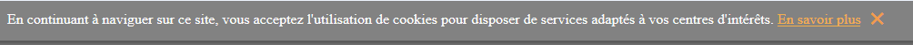

# Cookie.js

[](https://scrutinizer-ci.com/g/Sigmanificient/cookie/?branch=gh-pages)

Cookie.js display and hide cookies message in French or English website requirements.

## Get started

-   Include your cookie.js file at the end of your html file (`body`)
-   Make an Instance of cookie

```html

<script src='js/cookie.js'></script>
<script>
    window.onload = () => {
        let monCookie = new Cookie('fr');
    };
</script>
```

### Reset accepted cookies
There are 3 ways you can reset accepted cookies:

-   Clear browser cookies from your website
-   Removing cookie key using javascript
```js
localStorage.cookie=null;
```
-   Delete cookie key for application storage within web inspector.

<hr>
If you haven't accepted any cookies yet, you should see this message appears on the top of your web page.

    
