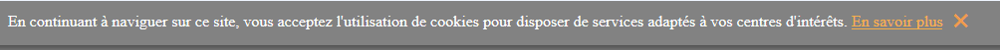

# COOKIE.JS

Cookie.js display and hide cookies message in french or english website requierment

## Exemple

include your cookie.js file at the end of your html file. Then Make an Instace of cookie and now it should work.

    
              
    </body>    

you should see this message appear on the top of your web page.

    
      

